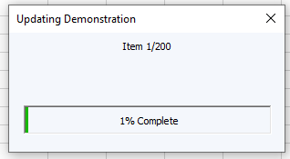

# VBA Progress Bar
This is an easy to use VBA userform for visualizing macro progress.

## Installation
1. Download source files from \src directory (`frmProgressbar.frm` and `.frx`) and save in the same local directory
2. From the Visual Basic Editor import `frmProgressbar.frm` (the `.frx` file with automatically come with it)

## Usage
### Show/Hide
Like most forms:
`frmProgressBar.Show` to show the progress bar.
`Unload frmProgressBar` to close the progress bar when you're done with it.
`frmProgressBar.Hide` to temporarily hide the progress bar but keep the changes.

### Update
There are 3 methods to update the appearance of the progress bar:
1. `frmProgressBar.Progress`
2. `frmProgressBar.Recaption`
3. `frmProgressBar.SetBarColor`

#### Progress
This method updates the length of the bar and can update the caption at the same time.  Intended to be used in a loop.

Arguments:
- `currentItem`: The current iteration number
- `totalItems`: The total iteration count
- `strUpperText`: *Optional* string for the upper caption
- `strLowerText`: *Optional* string for the lower caption

#### Recaption
This method only updates the captions, but does not affect the progress bar itself.

Arguments:
- `strUpperText`: *Optional* string for the upper caption
- `strLowerText`: *Optional* string for the lower caption

If no argument is provided the caption will remain unchanged.  Provide a null string if you want the caption to be blank.

#### SetBarColor
This method changes the color of the progress bar.
[Colors codes can be determined here](https://www.google.com/search?q=color+picker).

The method can accept colors as hex codes in the format [`&H00000000&`](https://www.thespreadsheetguru.com/the-code-vault/hex-color-codes-for-vba-userforms) or from the [RGB(255,255,255) function](https://docs.microsoft.com/en-us/office/vba/language/reference/user-interface-help/rgb-function).

Arguments:
- `barColor` - *Optional* Value representing desired progress bar color.

If the method is used and no `barColor` value is provided, the progress bar will default back to light green.

## Contributing
Pull requests are welcome. For major changes, please open an issue first to discuss what you would like to change.

## License
[MIT](https://choosealicense.com/licenses/mit/)